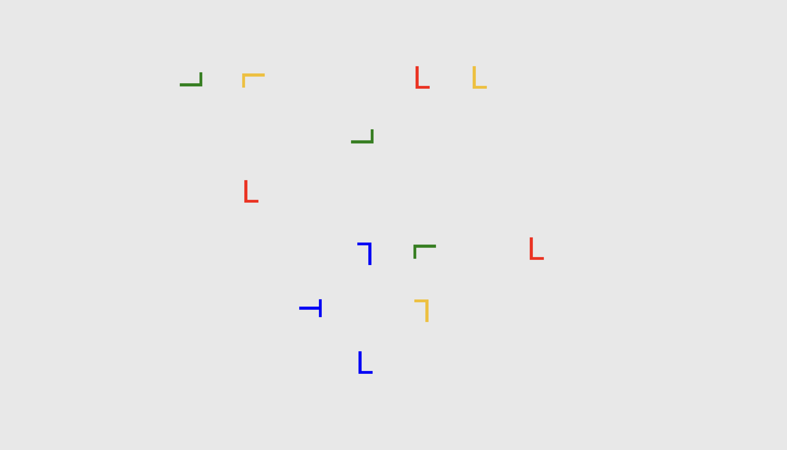

# Contextual cueing: implicit learning and memory of visual context guides spatial attention (Chun & Jiang, 1998)
A browser based implementation of the first experiment from [Contextual cueing: implicit learning and memory of visual context guides spatial attention](https://pubmed.ncbi.nlm.nih.gov/9679076/) using jsPsych.
It is intended to be used as a demonstration when discussing the paper in a lecture.

This implementation deviates slightly from the original paradigm, as no jittering of the grid position was applied to either target or distractor stimuli.

<p align="center">

</p>

## Prerequisites

[Docker](https://www.docker.com/get-started) and [Docker Compose](https://docs.docker.com/compose/install/) are needed for deployment.

This project was developed and deployed on MacOS and Ubuntu systems.


## Deployment

After cloning the repository, you can build the project by running

```
./build-container.sh
```

in the [prod_contextual-cueing-chun-jiang](prod_contextual-cueing-chun-jiang/) directory. 
This will automatically start the webserver serving the app, you can stop it with
```
docker-compose down
```

and later restart it with

```
docker-compose up -d
```

in the [prod_contextual-cueing-chun-jiang](prod_contextual-cueing-chun-jiang/) directory.

Depending on your setup, you might want to change the ip mapping in [prod_contextual-cueing-chun-jiang/docker-compose.yml](prod_contextual-cueing-chun-jiang/docker-compose.yml). I recommend leaving it the way it is and pointing an apache reverse proxy or something similar to the specified port.

## Development

When initially cloning the project and after making changes, update the files in the local webroot by running

```
./build.sh
```

Build the docker container for the webserver by running 
```
docker-compose build
```
in the root directory of the repository.

### Running the server

In order to run the development server, run 
```
docker-compose up -d
```

in the root directory. You can stop the server with 
```
docker-compose down
```


in the root directory. By the default, the server is reachable at [127.0.0.1:7000](http://127.0.0.1:7000)

## Built With

  - [jsPsych](https://www.jspsych.org/)
  
## Authors

- **Adrian Steffan** [adriansteffan](https://github.com/adriansteffan) [website](https://adriansteffan.com/)


## License

This project is licensed under the [GNU GPLv3](LICENSE.md) - see the [LICENSE.md](LICENSE.md) file for
details


